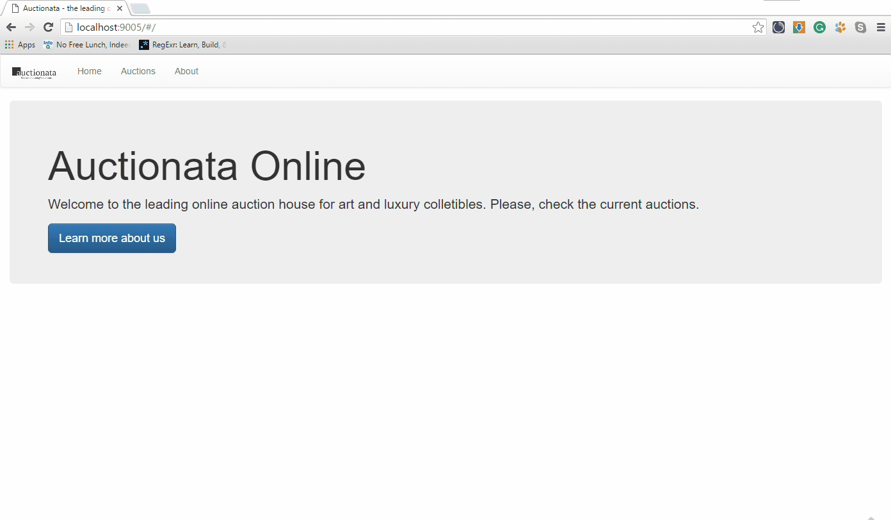

# Auctionata-online-app

This app is responsible for enabling bidder to participate of an auction.

# Stack

+ React
+ Flux
+ Gulp
+ Bootstrap

# Business Rules

+ You can't place a bid when your bid is lower than the initial price or any other existing bid.

# How To run? (In command line)

+ Run the web api (https://github.com/mayconbeserra/auctionata-online-web-api)
+ npm install
+ gulp

# Demo

+ 
